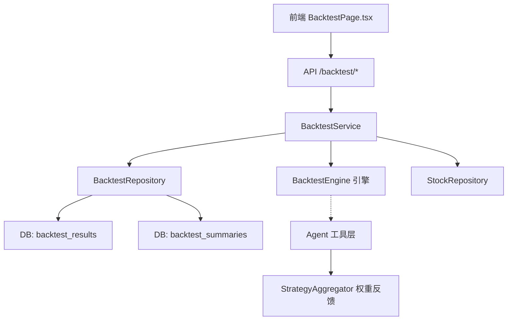

# 回测系统深度评估与改进方案

> 基于对 `backtest_engine.py`、`backtest_service.py`、`backtest_repo.py`、`backtest_tools.py`、`aggregator.py`、`BacktestPage.tsx` 及全部测试文件的逐行分析。

---

## 一、系统定位

> 这是一个**为评估 AI 预测能力而设计的信号打分器**，而非金融级量化回测框架。

在这个定位下，架构分层清晰、评估逻辑完备、与 Agent 的闭环反馈设计出色。以下分析既涵盖其优势，也指出在专业量化层面的局限性。

---

## 二、架构全景



| 层次 | 文件 | 行数 | 职责 |
|------|------|------|------|
| 引擎层 | [backtest_engine.py](file:///Users/hewei/Documents/GitHub/daily_stock_analysis/src/core/backtest_engine.py) | 556 | 纯逻辑评估：方向判断、止盈止损模拟、结果分类、汇总统计 |
| 服务层 | [backtest_service.py](file:///Users/hewei/Documents/GitHub/daily_stock_analysis/src/services/backtest_service.py) | 447 | 候选筛选、数据补全、批量评估、汇总计算 |
| 数据层 | [backtest_repo.py](file:///Users/hewei/Documents/GitHub/daily_stock_analysis/src/repositories/backtest_repo.py) | 222 | 候选查询、批量保存、UPSERT、分页 |
| API 层 | [backtest.py](file:///Users/hewei/Documents/GitHub/daily_stock_analysis/api/v1/endpoints/backtest.py) | 161 | POST /run, GET /results, GET /performance |
| Agent 工具 | [backtest_tools.py](file:///Users/hewei/Documents/GitHub/daily_stock_analysis/src/agent/tools/backtest_tools.py) | 179 | LLM Agent 读取回测摘要 |
| 策略聚合 | [aggregator.py](file:///Users/hewei/Documents/GitHub/daily_stock_analysis/src/agent/strategies/aggregator.py) | 199 | 利用回测胜率动态调整策略权重 |
| 前端 | [BacktestPage.tsx](file:///Users/hewei/Documents/GitHub/daily_stock_analysis/apps/dsa-web/src/pages/BacktestPage.tsx) | 445 | 回测触发、结果表格、Performance 卡片 |
| 测试 | 3 个测试文件 | 621 | 引擎单元测试 + 服务集成测试 + 汇总测试 |

---

## 三、现有优势 ✅

### 1. 引擎层 DB-agnostic
`BacktestEngine` 完全不依赖数据库，使用 Protocol 接口定义输入，便于单元测试和独立复用。

### 2. 评估逻辑完备
- 中英双语操作建议解析（买入/sell/观望/hold 等）
- 否定语义识别（"不要卖出" ≠ 卖出，`_is_negated` 检查前缀否定词）
- 方向四分类：`up` / `down` / `not_down` / `flat`
- 止盈止损模拟含 ambiguous 冲突处理

### 3. 闭环反馈
回测胜率 → `StrategyAggregator` 权重调整 → `AgentMemory` → Agent 自我校准

### 4. 幂等与容错
- `force=False` 自动跳过已评估记录
- `_try_fill_daily_data` 自动补全缺失日线数据
- 异常 catch 后记录 `error` 状态，不中断批量流程

### 5. 测试覆盖
引擎层 15+ 场景覆盖（买/卖/持有/观望/否定/不足数据/模糊等），服务层有集成测试。

---

## 四、六大痛点分析

### 痛点 1：跳过 AI 建仓价（ideal_buy）🔴 最关键

```python
# backtest_engine.py L199
simulated_entry_price = start_price if position == "long" else None
```

**问题**：系统强制以分析当天收盘价入场。如果 AI 建议"等回调到 10.5 元再买"（当前 11 元），系统直接按 11 元算全仓买入，止损止盈全部因此偏移。AI 被"冤枉"——本想挂单埋伏，却被强制追高。

**影响**：系统性偏离 AI 真实意图，尤其对"回调买入"类建议的胜率统计严重失真。

**建议修复**：
```python
# 伪代码：尊重 AI 的理想买点
if ideal_buy is not None:
    # 检查窗口内最低价是否触及理想买点
    if any(bar.low <= ideal_buy for bar in window_bars):
        simulated_entry_price = ideal_buy
    else:
        eval_status = "not_triggered"  # 未成交，不计入盈亏
else:
    simulated_entry_price = start_price  # 兼容旧逻辑
```

---

### 痛点 2：日线颗粒度的"薛定谔止损" 🟡

```python
# backtest_engine.py L488-492
if stop_hit and tp_hit:
    first_hit = "ambiguous"
    exit_price = stop_loss
    exit_reason = "ambiguous_stop_loss"
```

**问题**：日线 OHLC 无法判断日内止盈/止损谁先触发。

**现有处理**：标记为 `ambiguous`，保守假设止损先触发，且 `ambiguous_rate` 单独统计。

**客观评价**：处理方式**合理且有意识**，不是"一刀切打死"。真正的问题是高波动标的 ambiguous 比例过高时评估失去意义。

**建议增强**：
- 当某标的 `ambiguous_rate > 20%` 时，在汇总中给出 ⚠️ 警告
- 引入"乐观/保守双轨"：分别计算两种假设下的指标，给出置信区间

---

### 痛点 3：NLP 意图解析脆弱 🟡

代码使用关键词匹配 + 否定前缀检测来推断方向：

```python
# 匹配优先级：bearish > wait > bullish > hold > flat（默认）
_BEARISH_KEYWORDS = ("卖出", "减仓", "强烈卖出", "sell", ...)
_BULLISH_KEYWORDS = ("买入", "加仓", "强烈买入", "buy", ...)
```

**客观评价**：
- 否定识别（`_is_negated`）已做得不错，"不要卖出"不会误判为 bearish
- 优先级排序合理：先查 bearish 再查 bullish，避免了"长期买入但短期卖出"误匹配为看多
- 但关键词方案本质上脆弱，复杂语义仍可能失效

**根本解法**：不增强 NLP，而是让 LLM 直接输出结构化信号枚举：
```json
{
  "signal": "buy",           // 枚举值，无歧义
  "ideal_buy": 10.5,         // 理想买点
  "stop_loss": 9.8,
  "take_profit": 12.0,
  "time_horizon": "short"    // short / medium / long
}
```

---

### 痛点 4：固定评估窗口与阈值 🔴

**双重问题**：

| 问题 | 现状 | 影响 |
|------|------|------|
| 固定窗口 | `eval_window_days` 默认 10 天 | 超短线和中长线建议用同一窗口不公平 |
| 固定阈值 | `neutral_band_pct` 默认 ±2% | 银行股涨 2% 和科技妖股涨 2% 含义完全不同 |

**建议**：
- 多窗口并行：`eval_window_days=[5,10,20,60]` 同时评估
- ATR 自适应阈值：`neutral_band = ATR(20) * multiplier` 替代固定 2%
- 让 AI 在输出中标注 `time_horizon`，自动选择匹配窗口

---

### 痛点 5：Long-Only 🟢 低优先级

```python
# 卖出建议 → cash，模拟收益恒为 0
if position != "long":
    simulated_return_pct = 0.0
```

**客观评价**：A 股不能做空，港股做空门槛高，Long-only 对主要市场合理。`direction_correct` 已能评估看空判断准确性，只是不模拟做空收益。改动量小（翻转止盈止损方向），但需求不迫切。

---

### 痛点 6：忽略交易损耗 🟢 低优先级

- 不考虑手续费（A 股万三）、印花税（千一）、滑点
- 止损出场使用理想止损价，实际跳空低开时无法精准成交

**最小改动建议**：
```python
# 止损滑点：用实际最低价 vs 止损价取较差值
exit_price = min(stop_loss, bar.low)  # 而非 exit_price = stop_loss
```

---

## 五、改进优先级矩阵

| 优先级 | 改进项 | 复杂度 | 影响 | 是否破坏兼容 |
|--------|--------|--------|------|-------------|
| 🥇 P0 | **结构化信号输出**（让 LLM 输出 `signal_enum` + `ideal_buy` + `time_horizon`） | 中 | 根治 NLP + 建仓价 + 窗口期三个痛点 | 否（追加字段） |
| 🥈 P0 | **理想建仓价机制**（`ideal_buy` 传入引擎，未触及标记 `not_triggered`） | 低 | 大幅提升回测与 AI 真实意图的契合度 | 否（向后兼容） |
| 🥉 P1 | **策略级标签**（`BacktestResult` 新增 `strategy_id`） | 低 | 让 Agent 按策略维度自我学习 | 否 |
| 4 | **多周期评估**（并行多 `eval_window_days`） | 中 | 不同信号用匹配窗口评判 | 否 |
| 5 | **ATR 自适应阈值** | 中 | 替代固定 2% 的 neutral band | 否 |
| 6 | **止损滑点模拟** | 低 | `min(stop_loss, bar.low)` 小改动 | 否 |
| 7 | **前端图表**（净值曲线、信号散点图、月度热力图） | 中 | 提升可读性 | 否 |
| 8 | **Ambiguous 警告机制** | 低 | 高波动标的评估可信度提示 | 否 |
| 9 | **投资组合级回测**（连续持仓、资金管理、夏普/回撤） | 高 | 真正的策略验证 | 否（新增模块） |
| 10 | **做空支持** | 低 | 美股/港股做空回测 | 否 |

---

## 六、推荐实施路径

### Phase 1：信号标准化（1-2 天）
- 在分析流程中要求 LLM 输出结构化 JSON（`signal_enum` / `ideal_buy` / `time_horizon`）
- `AnalysisHistory` 新增对应字段
- 引擎接受 `ideal_buy` 参数，向后兼容（为 None 时走旧逻辑）

### Phase 2：评估增强（2-3 天）
- 多周期并行评估
- ATR 自适应阈值
- 策略级标签 + 汇总
- 止损滑点修正

### Phase 3：可视化升级（3-5 天）
- 前端图表（对比曲线、热力图、散点图）
- Ambiguous 警告
- 策略对比仪表盘

### Phase 4：组合级回测（5-7 天）
- 新增 `portfolio_backtest_engine.py`
- 连续持仓模拟 + 资金管理
- 风险指标（夏普、最大回撤、Calmar）

---

## 七、总结

现有系统在其定位（AI 信号评估打分器）下做得**相当好**——架构解耦、逻辑完备、闭环反馈。六大痛点中，**结构化信号输出 + 理想建仓价**是最迫切的两个改进（低成本高收益），能让回测从"粗糙打分"升级到"精准评估 AI 意图"。后续的多周期、ATR 阈值、组合级回测可以渐进式推进，所有改动都可向后兼容，不需要推倒重来。
